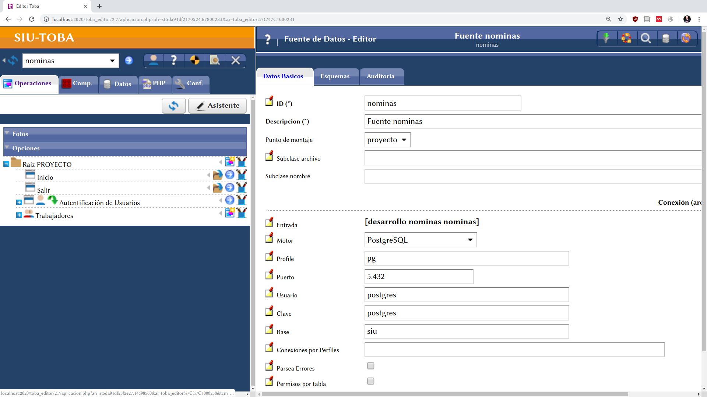
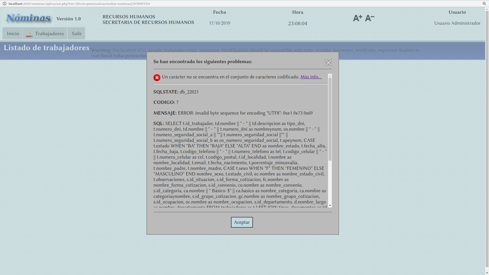

# Autoría

El presente trabajo se llevo a cabo a por la Analista en Sistemas de
Computación, Sandra Zacharski, para la cátedra Administración de Recursos
Humanos

# Propósito del Repositorio

Permitir que la cátedra pueda compartir el trabajo con futuras cohortes sin
todo el trajín que involucra la instalación de diferentes herramientas.

- Un ejemplo del trajín que se menciona es este trabajo que depende del
Framework web SIU Toba y el motor de bases de datos PostgreSQL 9.4. El Toba,
a su vez, tiene dependencias que se deben satisfacer.

Aquí se hace frente a esto mediante el uso de contenedores.

# Instrucciones de uso

> Herramientas necesarias:

> `Docker`

> `docker-compose`

> `Internet`

El stack para el proyecto consta de dos contenedores:

- `app`: este contiene a la aplicación desarrollada.
- `pg`: este contiene a la base de datos que es utilizada por la `app`

En el archivo `docker-compose.yml` se describe la forma en la que interactúan
estos dos contenedores para brindar la funcionalidad desarrollada.

Para poner en funcionamiento la aplicación basta con realizar los siguientes
pasos:

1. Iniciar un terminal en el directorio raíz del repositorio.
2. Introducir el comando `docker-compose up`
  - En un principio este va a descargar las imágenes necesarias de un registro
  en internet.
  - Va a regenerar la base de datos con los datos que Sandra brindó a la
  cátedra.
  - Va a proceder a realizar la inicialización del proyecto en el contenedor
  `app`
3. Al finalizar podrá acceder al proyecto mediante un navegador web a través de
   `localhost:2020/toba_editor/2.7`

   Se le presentará la pantalla de inicio de la siguiente manera
   

4. Al llegar al paso tres puede iniciar sesión seleccionando en el primer campo
el _Proyecto a EDITAR_ `nominas` y las credenciales serán las siguientes.
  - _Usuario_: toba
  - _Clave_: toba

5. Al dar clic en el botón `Ingresar` verá lo siguiente.

   

6. Puede proceder a la previsualización mediante el botón circular azul con una
   flecha en su interior que se encuentra a la derecha del combo que indica el
   proyecto actual.

# Pasos extra

## Primero

Al realizar el `Paso 6` verá la aplicación funcionando, aquí tendrá las
operaciones que fueron desarrolladas. Al intentar realizar cualquiera de las
que se tengan en la parte superior bajo la pestaña `Trabajadores` (ver
siguiente ilustración `Pestaña Trabajadores`) se le presentará el error que
se muestra en la ilustración `Error bases.ini`.

>Esto ocurre porque es necesario determinar, luego de la instalación, cuales
>serán las credenciales y la ubicación del motor de bases de datos que da
>soporte a la aplicación.

Puede proceder a cerrar la ventana de previsualización y seguir los pasos que
se describen a continuación.

1. En la barra que se tiene a la izquierda, navegar hacia el tab que se
   denomina `Datos`

   

2. Una vez ahí, expandir el ítem que tiene como título `Fuentes`, verá lo
   siguiente.

   

   Deberá presionar el botón azul que se encuentra en el extremo derecho de la
   fila para poder editar las propiedades de la fuente de datos. Al realizar
   esto será presentado con la siguiente pantalla.

   

3. Completar con los datos como se indica en la ilustración `Datos a
   completar`.

   

   Una vez terminado puede presionar el botón guardar que se encuentra en la
   parte inferior derecha. Una vez se guarden los cambios se habilitarán una
   serie de tabs en la parte superior (ver ilustración `Datos guardados`).

   

## Segundo

Si se procede a una previsualización luego de realizar los pasos anteriores, y
se busca listar los `Trabajadores` que se tengan registrados en la pestaña
`Trabajadores > Listado de trabajadores` (ver ilustración `Listado de
trabajadores`) se presentará otro error (ver ilustración `Error codificación`).

> Esto se da porque parte de la configuración anterior debe ser el decirle al
> Toba en qué codificación se debe leer de la base de datos, al utilizar
> cuestiones en el español tales como tildes, diéresis, ñ, etc, el Toba trata
> de mapear estos caracteres 'raros' a UTF-8 y se encuentra con un problema
> y dice que "no se encuentra el conjunto de caracteres codificado".

La solución está en decirle que lo que se lea de la base de datos él (Toba) lo
codifique como `LATIN1` aquí entran en juego las pestañas nuevas que se
agregaron al final del paso numero `3` del procedimiento anterior.

1. Procedemos a acceder a la pestaña `Esquemas` (pestaña que apareció al
   finalizar la configuración del paso `3` del procedimiento anterior)

2. Este lo debemos completar de la siguiente manera.

   

   Luego se procede a guardar mediante el botón en la parte inferior derecha.

